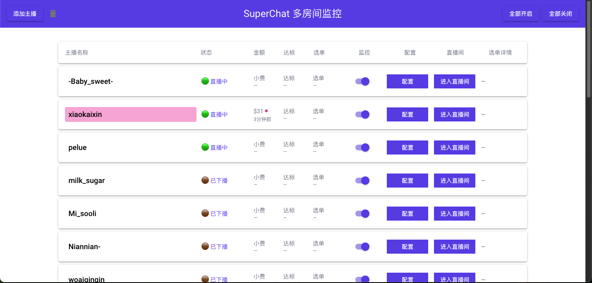

# SuperChat 监控面板

一个用于监控 SuperChat 直播平台的主播打赏、菜单打赏和目标达成事件的实时监控系统。

## 功能特性

- 🎯 **高额打赏监控**：监控超过设定阈值的小费打赏
- 📋 **菜单打赏监控**：监控选中的菜单项打赏
- 🎯 **目标达成监控**：监控主播目标达成事件
- 🔔 **浏览器通知**：实时推送通知到浏览器
- 📊 **实时状态显示**：显示主播在线状态、打赏信息等
- 🔄 **自动排序**：直播中的主播自动排在前面

### 监控面板


### 选择要监控的打赏菜单项


## 技术栈

- Python 3
- Playwright（用于获取 uniq 和 cookies）
- aiohttp（异步 HTTP 请求）
- NiceGUI（Web UI 框架）

## 安装依赖

```bash
pip install playwright aiohttp aiohttp-socks requests nicegui
python -m playwright install chromium
```

## 配置

1. 在 `monitor_tip.py` 中配置代理PROXY（如需要）
2. 运行程序：`python monitor_tip.py`

## 使用说明

1. 启动程序后，访问 `http://localhost:8080` 打开监控面板
2. 在面板中可以：
   - 查看所有主播的实时状态
   - 配置每个主播的打赏阈值
   - 选择要监控的菜单项
   - 开启/关闭监控

## 注意事项

- 在某些国家需要配置代理才能访问目标网站
- 首次运行需要授权浏览器通知权限

